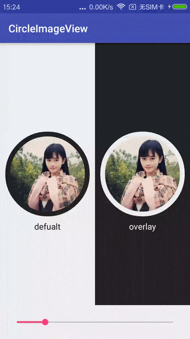

# CircleImageView

Android中一款简单高效的圆形图片组件

- 高效精简的圆形图像组件
- 支持自定义边框宽度
- 支持自定义边框颜色
- 支持自定义边框样式

## Usages

- dependencies

```
compile 'cn.service.coding:widget-circleimageview:1.0.0'
```

- Just use like Imageview

```
<cn.kerison.coding.widget.CircleImageView
        android:id="@+id/image_view_light"
        android:layout_width="160dp"
        android:layout_height="160dp"
        android:layout_centerInParent="true"
        android:src="@drawable/avatar"
        app:civ_border_overlay="false"
        app:civ_border_width="2dp"
        app:civ_border_color="@color/dark"/>
```


## Preview



## Thanks

Fork and optimize from [CircleImageView](https://github.com/hdodenhof/CircleImageView)
